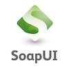
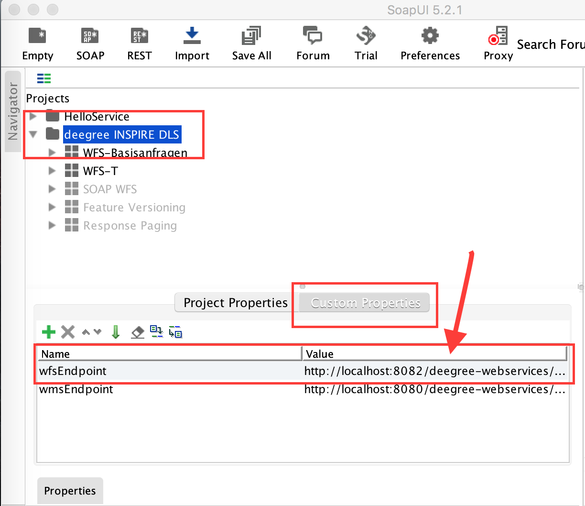
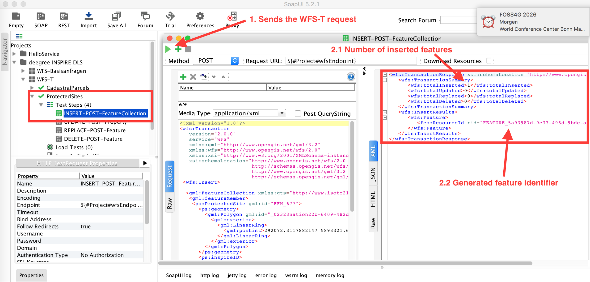

# Quickstart Tutorial "INSPIRE Network Services with deegree on Docker"

## Agenda   

1. [Setup the Docker infrastructure](#part-1---)

2. [Configure INSPIRE Direct Access Download Services based on deegree WFS 2.0](#part-2---configure-wfs-20-)

3. [Import test data using deegree WFS-T interface](#part-3---import-test-data--)

4. [Retrieve data with different clients](#part-4---retrieve-data-)

5. [Validate service and data](#part-5---validate-deegree-webservice-)

## Tutorial online

SELF-LINK: **[https://github.com/lat-lon/deegree-workshop/blob/nintyMinutesQuickTutorial/README.md](https://github.com/lat-lon/deegree-workshop/blob/nintyMinutesQuickTutorial/README.md)**  

**[Link to all slides at the end of the document!](#tutorial-resources-and-slides)**

# Part 1 - 

## Install docker

[7 minute tutorial how to install Docker Community Edition (CE)](https://docs.docker.com/install/) 

On Ubuntu:

    sudo apt-get install docker-engine

## Start docker daemon

    sudo service docker start

## Verify that docker is installed correctly

    docker run hello-world

_**Attention:** On LINUX the docker daemon binds on a UNIX socket which is owned by the user root and other users can access it with sudo. For this reason, docker daemon always runs as the root user._

## Get docker images and run docker infrastructure

### Spatial Database 

 

Docker Hub: [https://hub.docker.com/r/mdillon/postgis/](https://hub.docker.com/r/mdillon/postgis/)

To download the docker image from the docker registry hub.docker.com run:

    docker pull mdillon/postgis

In case no Internet connection is available you can import a Docker image from a tar archive:

    docker load -i <PATH_TO_USB_DRIVE>/Docker/postgis.tar

To run the Docker container execute:

    docker run -d --name postgis -p 5432:5432 mdillon/postgis

_**Hint:** You can find an overview of basic Docker commands at the end of this tutorial under [Overview of basic docker commands](#overview-of-basic-docker-commands)._ 

#### pgAdmin4 web console

Docker Hub: [https://hub.docker.com/r/fenglc/pgadmin4/](https://hub.docker.com/r/fenglc/pgadmin4/)

    docker pull fenglc/pgadmin4
    docker run -d --name pgadmin4 -p 5050:5050 --link postgis:postgres fenglc/pgadmin4

Open in browser: [http://localhost:5050/browser/](http://localhost:5050/browser/)

Use the following credential to login:

User: 		pgadmin4@pgadmin.org

Password: 	admin

_**Hint**: On Windows and macOS when running Docker with Docker Toolbox (using VirtualBox) you have to use the IP of the Docker Machine, such as 192.168.99.100 as the  container IP instead of localhost!_

#### Connection parameters for DBA

Hostname: 	postgres

Port: 		5432

User:		postgres

## eegree Webservices 

Docker Hub: [https://hub.docker.com/r/deegree/deegree3-docker/](https://hub.docker.com/r/deegree/deegree3-docker/)

Dockerfile: [https://github.com/deegree/deegree3-docker](https://github.com/deegree/deegree3-docker)

    docker pull deegree/deegree3-docker

Now link the deegree container with the postgis container and ro run the container attached to the deegree log execute the command:

    docker run --name deegree -p 8080:8080 --link postgis:db deegree/deegree3-docker

Open in browser: [http://localhost:8080/deegree-webservices](http://localhost:8080/deegree-webservices)

After you have successfully tested the database connection you can stop the docker container with `CTRL+c`.

### Useful commands to monitor the docker container

* `docker logs -f deegree`	- follow the deegree console output

* `docker attach deegree`	- attach to the deegree container
    * You can detach from the container and leave it running with `CTRL-p CTRL-q`. Requires to pass `-it` option to the docker run command!
    * You can stop the container with `CTRL+c`.	

* `docker exec -it deegree '/bin/bash'` - opens a shell in the running deegree container. 
    * Use command `exit` to disconnect from the container.

* `docker stats deegree` 	- This will present the CPU utilization for the container, the memory used and total memory available to the container.

* `docker network inspect bridge` 	- lists the IP for each container.

# Part 2 - configure WFS 2.0 

## Start deegree docker container with local deegree workspace directory

Download one of the deegree workspace bundle (as ZIP file) for the INSPIRE data themes:

* Protected Sites:  	[deegree3-workspace-ps](https://github.com/lat-lon/deegree-workshop/tree/master/deegree3-workspace-ps)

* Cadastral Parcels: 	[deegree3-workspace-cp](https://github.com/lat-lon/deegree-workshop/tree/master/deegree3-workspace-cp)

Create a new directory `.deegree` in the user home directory and copy all files into the `~/.deegree` directory. 

Stop and delete the docker container deegree before you continue with:

    docker stop deegree
    docker rm deegree

Start now a **new** container with mounted user home directory `~/.deegree`:

    docker run -d --name deegree -v ~/.deegree:/root/.deegree -p 8080:8080 --link postgis:db deegree/deegree3-docker

Open the deegree services console: [http://localhost:8080/deegree-webservices](http://localhost:8080/deegree-webservices) 

## Start deegree WFS serving INSPIRE data theme Protected Sites

To configure a INSPIRE direct-access download service based on deegree WFS 2.0 serving harmonized data the following steps are needed:

1. Create the database and schema with the provided SQL scripts using pgAdmin or use the shell script `scripts/setupDB.sh`

2. Select and reload the workspace for Protected Sites in the deegree service console

Each workspace bundle (deegree3-workspace-cp.zip and deegree3-workspace-ps.zip) contains the following resources:

| Directory       | Content     | Documentation |
| :-------------- | :---------- | :------------ |   
| `/ddl`          | SQL DDL scripts for canonical and blob mapping | [PostgreSQL](https://www.postgresql.org/docs/current/static/tutorial.html), [PostGIS](http://workshops.boundlessgeo.com/postgis-intro/) |
| `/scripts`      | Shell scripts to execute all SQL scripts using psql CLI (Linux/Unix only) |  |
| `/test`         | SoapUI project for testing | [Getting started with SoapUI](https://www.soapui.org/getting-started/your-first-soapui-project.html) | 
| `/workspace-cp` | Complete deegree workspace with WFS and WMS configuration for INSPIRE Annex 1 data theme Cadastral Parcels including a configuration set for BLOB and canonical mapping | [Configuration basics with deegree](http://download.deegree.org/documentation/3.4.0/html/lightly.html#example-workspace-1-inspire-network-services) |
| `/workspace-ps` | Complete deegree workspace with WFS and WMS configuration for INSPIRE Annex 1 data theme Protected Sites including a configuration set for BLOB and canonical mapping   | [Configuration basics with deegree](http://download.deegree.org/documentation/3.4.0/html/lightly.html#example-workspace-1-inspire-network-services) |

### Detailed description for Protected Sites with canonical database structure

The shell script `setupDB.sh` creates both, the canonical and BLOB database schema!

1. Create the database using pgAdmin

    1. As user postgres create user and database
        
        - `~/.deegree/ddl/01_create_deegree_user.sql`
        - `~/.deegree/ddl/ps-canonical/02_create_ps_canonical_db.sql`
        - `~/.deegree/ddl/03_create_extension_postgis.sql`
        
    2. As user deegree connect to ps_canonical database and create the schema with 
    
        - `~/.deegree/ddl/ps-canonical/04_create_ps_canonical_schema.sql`

2. Now open the deegree service console and reload the workspace:

    1. The WFS service configuration is located in `/services/wfs_ps_canonical.xml`

#### Service Address

WFS Endpoint: [http://localhost:8080/deegree-webservices/services/wfs_ps_canonical](http://localhost:8080/deegree-webservices/services/wfs_ps_canonical)

WFS Capabilities:

[http://localhost:8080/deegree-webservices/services/wfs_ps_canonical?service=WFS&request=GetCapabilities](http://localhost:8080/deegree-webservices/services/wfs_ps_canonical?service=WFS&request=GetCapabilities)

### Database schema and deegree SQLFeatureStore configuration based on BLOB-mode GML application mapping

1. Create the database using pgAdmin

    1. As user postgres database

        - `~/.deegree/ddl/ps-blob/create_ps_blob_db.sql`

    2. As user deegree connect to ps_blob database and create the schema with 
    
        - `~/.deegree/ddl/ps-blob/04_create_ps_blob_schema.sql`

2. Reload the workspace to activate the changes!

#### Service Address

WFS Endpoint: [http://localhost:8080/deegree-webservices/services/wfs_ps_blob](http://localhost:8080/deegree-webservices/services/wfs_ps_blob)

WFS Capabilities:

[http://localhost:8080/deegree-webservices/services/wfs_ps_blob?service=WFS&request=GetCapabilities](http://localhost:8080/deegree-webservices/services/wfs_ps_blob?service=WFS&request=GetCapabilities)

### Supporting tools

Tools to create the SQL DDL and the deegree SQLFeatureStore configuration files:

* deegree services console - [http://localhost:8080/deegree-webservices/](http://localhost:8080/deegree-webservices/) 

    * in 3.4-RC7 and later the wizard is broken (see [issue #471](https://github.com/deegree/deegree3/issues/471) and related issues) 

* [deegree CLI utility tool](https://github.com/deegree/deegree3/tree/master/deegree-tools/deegree-tools-config) 

# Part 3 - Import test data   

Dockerfile: -

_**Hint**: Download SoapUI here: [https://www.soapui.org/downloads/soapui.html](https://www.soapui.org/downloads/soapui.html)_, and unzip the package. Then start SoapUI using the start scripts or the links created by the installer. For a short intro use the [Getting Starting Guide](https://www.soapui.org/getting-started/).

## Setting custom properties

Open the file `deegree3-workspace-ps/test/wfs200-soapui-project.xml` with SoapUI and select the project root node. 

Switch to "Custom Properties" tab and set for property “wfsEndpoint”:

* To import data into the SQLFeatureStore in BLOB modus use:
[http://deegree:8080/deegree-webservices/services/wfs_ps_blob](http://deegree:8080/deegree-webservices/services/wfs_ps_blob)

* The WFS configured with the SQLFeatureStore in relational/canonical modus use:
[http://deegree:8080/deegree-webservices/services/wfs_ps_canonical](http://deegree:8080/deegree-webservices/services/wfs_ps_canonical)

## Import sample test data over WFS-T Insert operation

To send a WFS-T Insert action submit the test step "INSPIRE ProtectedSite > Transaction > INSERT-POST-FeatureCollection":

Switch the "wfsEndpoint" property to the other endpoint and re-submit the WFS-T Insert request to insert the data also in the other database.

## Import data with HALE

1. Download and install HALE [http://www.esdi-community.eu/projects/hale](http://www.esdi-community.eu/projects/hale) 

2. Download and unzip [http://grillmayer.eu/wp-content/uploads/2014/12/Protected_Sites_DS_Version_4_Example-1.zip](http://grillmayer.eu/wp-content/uploads/2014/12/Protected_Sites_DS_Version_4_Example-1.zip) 

3. Import project "Protected_Sites_DS_Version_4_Example.hale" into HALE workbench

4. Start the "Export transformed data" function and select “WFS-T” as destination using one of the WFS endpoints configured.

_**Attention**: Importing large GML files may require more hardware resources. Please check [github issue #743](https://github.com/deegree/deegree3/issues/743) for further information._ 

# Part 4 - Retrieve data 

Docker hub: [https://hub.docker.com/r/kartoza/qgis-desktop/](https://hub.docker.com/r/kartoza/qgis-desktop/)

Dockerfile: [https://github.com/kartoza/docker-qgis-desktop](https://github.com/kartoza/docker-qgis-desktop)

_**Hint**: This docker container requires X windows running on the host (LINUX or macOS are required!). For Windows download QGIS here: [http://download.qgis.org](http://download.qgis.org)_ 

    docker pull kartoza/qgis-desktop

QGIS 2.18:

    xhost +
    docker run --name gqis-desktop_2_18 -i -t -v /tmp/.X11-unix:/tmp/.X11-unix -v ${HOME}:/home/${USER} -e DISPLAY=unix:0 --link deegree:deegree --rm kartoza/qgis-desktop:2.18.17 '/usr/bin/qgis'

QGIS 2.18 (latest DEV):

    xhost +
    docker run --name gqis-desktop_master -i -t  -v /tmp/.X11-unix:/tmp/.X11-unix -v ${HOME}:/home/${USER} -e DISPLAY=unix:0 --link deegree:deegree --rm kartoza/qgis-desktop:latest '/usr/bin/qgis'

WMS Endpoint for PS: [http://localhost:8080/deegree-webservices/services/wms_ps](http://localhost:8080/deegree-webservices/services/wms_ps) 

WMS Capabilities: [http://localhost:8080/deegree-webservices/services/wms_ps?service=WMS&request=GetCapabilities](http://localhost:8080/deegree-webservices/services/wms_ps?service=WMS&request=GetCapabilities) 

# Part 5 - Validate deegree Webservice 

Docker hub: [https://hub.docker.com/r/dstenger/teamengine-ets-all/](https://hub.docker.com/r/dstenger/teamengine-ets-all/)

Dockerfile: -

## TEAM Engine 4.10 with WFS ETS 1.26:

    docker pull dstenger/teamengine-ets-all
    docker run -d --name teamengine -p 8088:8080 --link deegree:deegree dstenger/teamengine-ets-all

Open in browser: [http://localhost:8088/teamengine](http://localhost:8088/teamengine)

Use either

* [http://deegree:8080/deegree-webservices/services/wfs_ps_canonical?service=WFS&request=GetCapabilities](http://deegree:8080/deegree-webservices/services/wfs_ps_canonical?service=WFS&request=GetCapabilities)

* [http://deegree:8080/deegree-webservices/services/wfs_ps_blob?service=WFS&request=GetCapabilities](http://deegree:8080/deegree-webservices/services/wfs_ps_blob?service=WFS&request=GetCapabilities)

to run the validation against.

### deegree WFS 2.0 Reference Implementation online:

[http://cite.deegree.org/deegree-webservices-3.4.12/services/wfs200?service=WFS&request=GetCapabilities](http://cite.deegree.org/deegree-webservices-3.4.12/services/wfs200?service=WFS&request=GetCapabilities)

## Further testing with the INSPIRE Reference Validator

Docker hub: [https://hub.docker.com/r/iide/etf-webapp/](https://hub.docker.com/r/iide/etf-webapp/)

Dockerfile: [https://github.com/interactive-instruments/etf-webapp](https://github.com/interactive-instruments/etf-webapp) 

    docker pull iide/etf-webapp
    docker run --name etf -d -p 8188:8080 -v ~/etf:/etf --link deegree:deegree iide/etf-webapp:latest

Open in browser: [http://localhost:8188/etf-webapp](http://localhost:8088/etf-webapp)

To allow access to the local Docker Container running deegree you need to change the configuration file `~/etf/config/etf-config.properties` and set the property:

    etf.testobject.allow.privatenet.access = true

More information how to configure the etf-web application under [http://docs.etf-validator.net/](http://docs.etf-validator.net/) and [https://github.com/inspire-eu-validation/ets-repository](https://github.com/inspire-eu-validation/ets-repository). 

# Troubleshooting

* Can’t access docker from the command line - 

    * check if the docker daemon is running and use `sudo`

* Error while starting docker container - 

    * check system resources if memory is still available

    * Remove the container with docker rm and re-run the container

* For more hints and tips check [https://docs.docker.com/toolbox/faqs/troubleshoot/](https://docs.docker.com/toolbox/faqs/troubleshoot/)

    * For Mac OS : [https://docs.docker.com/docker-for-mac/troubleshoot/](https://docs.docker.com/docker-for-mac/troubleshoot/)

    * For Windows:  [https://docs.docker.com/docker-for-windows/troubleshoot/](https://docs.docker.com/docker-for-windows/troubleshoot/)

* Can’t access the Docker container within Docker network then try the following

    * `docker network create -d bridge --subnet 192.168.0.0/24 --gateway 192.168.0.1 inspirenet`

    * `docker network connect inspirenet deegree`

    * `docker network connect inspirenet etf`

    * `docker network connect inspirenet postgis`

    * `docker network connect inspirenet teamengine`

    * And retry to access the Docker container

* Can’t insert data into the database

    * Check if the user deegree has all needed privileges

    * Grant user deegree all privileges with:

        * `GRANT ALL ON SCHEMA public TO deegree;`

        * `GRANT SELECT, INSERT, UPDATE, DELETE ON ALL TABLES IN SCHEMA public TO deegree;`

        * `GRANT USAGE, SELECT ON ALL SEQUENCES IN SCHEMA public to deegree;`
        
# Overview of basic docker commands
 
 General structure of the docker CLI:
 
     docker <command> [options] [arguments]
 
 Display help per docker command:
 
 * `docker <command> --help` 	- Show help per docker command
 
 Commands and options used within this tutorial:
 
 * `docker info` 		- Display system-wide information
 
 * `docker images`		- List images
 
 * `docker pull`		- Pull an image or a repository from a registry (e.g. [hub.docker.com](https://hub.docker.com/))
 
 * `docker ps`		- List containers
 
     * -a 		- Show all containers, incl. **stopped** containers
 
 * `docker network ls`	- List all networks
 
 * `docker run`		- Run a command in a **new** container
 
     * -d, --detach      	Run container in background and print container ID
 
     * -e, --env value           	Set environment variables (default [])
 
     * -i, --interactive           	Keep STDIN open even if not attached
  
     * --link value                  Add link to another container (default [] / )
 
     * -m, --memory string  	Memory limit (format: <number><unit>, where unit = b, k, m or g)
 
     * --name string            	Assign a name to the container
 
     * --network string      	Connect a container to a network (default "default" / [host, bridge]
 
     * -p, --publish value      	Publish a container's port(s) to the host (default [] / host:container)
 
     * --rm                          	Automatically remove the container when it exits
 
     * -t, --tty                 	Allocate a pseudo-TTY
 
     * -v, --volume value   	Bind mount a volume (default [] / host_dir:container_dir)
 
 * `docker exec`		- Run a command in a **running** container
 
 * `docker logs`		- Fetch the logs of a container
 
     * -f, --follow    	- Follow log output
 
 * `docker start`		- Start one or more stopped containers
 
 * `docker stop`		- Stop one or more running containers
 
 * `docker load`		- Load a docker image from a tar archive file
 
 * `docker save`		- Save a docker image into a tar archive file
 
 * `docker rm` 		- Remove one or more containers
 
 * `docker rmi`		- Remove one or more images
        
# Links for further reading and resources

### Complete Tutorial Bundle 

[FOSSGIS Konference 2018_Workshop ZIP-Bundle](http://www.lat-lon.de/Download/20180322_FOSSGISConf2018_Workshop.zip)

## Tutorial resources and slides 

- slides/01_T_Introduction.pdf
- slides/02_T_INSPIRE-Download-Services.pdf
- slides/03_TP_Docker.pdf
- slides/04_P_deegree-on-Docker.pdf
- slides/05_TP_deegree.pdf
- slides/06_P_Configuration-of-a-deegree-INSPIRE-Download-Service.pdf
- slides/07_TP_Validation-of-service-and-data.pdf

### Archive:

[INSPIRE Conference 2017_Workshop ZIP-Bundle](http://www.lat-lon.de/Download/20170904_INSPIREConf2017_Workshop.zip)

[FOSS4G 2016 Workshop](https://github.com/tfr42/deegree-docker/tree/foss4g2016_workshop)

## Docker

[https://www.docker.com](https://www.docker.com)

[https://docs.docker.com](https://docs.docker.com)

[https://hub.docker.com](https://hub.docker.com)

[http://linoxide.com/linux-how-to/run-gui-apps-docker-container/](http://linoxide.com/linux-how-to/run-gui-apps-docker-container/)

### Talks about Docker and GIS

Talk (german) - [FOSSGIS 2018 - Dockerize stuff - Postgis swarm and other geo boxes](https://www.fossgis-konferenz.de/2018/programm/event.php?id=5292)

Video (german) - [Docker für den GIS-Einsatz](https://www.fossgis.de/konferenz/2015/programm/events/847.de.html)

Slides (english) - [Spatial Data Processing with Docker](https://2016.foss4g-na.org/session/spatial-data-processing-docker.html)

Video (german) - [FOSS4G 2016 - Docker Images for Geospatial](https://ftp.gwdg.de/pub/misc/openstreetmap/FOSS4G-2016/foss4g-2016-1146-an_overview_of_docker_images_for_geospatial_applications-hd.mp4)

Talk (english)- [INSPIRE ready SDI using docker](https://inspire.ec.europa.eu/events/conferences/inspire_2017/submissions/169.html)

## deegree resources

[https://github.com/deegree/deegree3](https://github.com/deegree/deegree3)

[https://www.deegree.org](https://www.deegree.org)

[https://www.osgeo.org/projects/deegree/](https://www.osgeo.org/projects/deegree/) 

[https://www.fossgis.de/aktivit%c3%a4ten/langzeitf%c3%b6rderungen/deegree/](https://www.fossgis.de/aktivit%c3%a4ten/langzeitf%c3%b6rderungen/deegree/)

Documentation 3.3.x - [https://download.deegree.org/documentation/3.3.21/html/](https://download.deegree.org/documentation/3.3.21/html/) 

Documentation 3.4.x - [https://download.deegree.org/documentation/current/html/](https://download.deegree.org/documentation/3.4.26/html/) 

### deegree on Docker Hub

[https://hub.docker.com/r/deegree/deegree3-docker/](https://hub.docker.com/r/deegree/deegree3-docker/)

### Public available deegree workspace configurations for INSPIRE

[https://github.com/de-bkg/deegree-workspace-dlm250-inspire](https://github.com/de-bkg/deegree-workspace-dlm250-inspire)

[https://github.com/DirkThalheim/deegree-elf](https://github.com/DirkThalheim/deegree-elf)

[https://github.com/eENVplus/deegree-workspace-eenvplus](https://github.com/eENVplus/deegree-workspace-eenvplus) 

## OGC CITE TEAM Engine

[https://github.com/opengeospatial/teamengine](https://github.com/opengeospatial/teamengine)

[http://opengeospatial.github.io/teamengine/](http://opengeospatial.github.io/teamengine/)

[http://cite.opengeospatial.org](http://cite.opengeospatial.org)

[http://cite.opengeospatial.org/teamengine/](http://cite.opengeospatial.org/teamengine/)

[https://github.com/opengeospatial/teamengine-docker](https://github.com/opengeospatial/teamengine-docker)

## INSPIRE resources

### General Information about INSPIRE

[http://inspire.ec.europa.eu/](http://inspire.ec.europa.eu/)

[http://www.slideshare.net/ChrisSchubert1/inspirehandsondatatransformation](http://www.slideshare.net/ChrisSchubert1/inspirehandsondatatransformation)

### Validation tools for INSPIRE

[http://inspire-geoportal.ec.europa.eu/validator2/](http://inspire-geoportal.ec.europa.eu/validator2/)

[http://inspire-sandbox.jrc.ec.europa.eu/validator/](http://inspire-sandbox.jrc.ec.europa.eu/validator/) 

[https://github.com/interactive-instruments/etf-test-projects-elf](https://github.com/interactive-instruments/etf-test-projects-elf) 

[https://github.com/Geonovum/etf-test-projects-inspire](https://github.com/Geonovum/etf-test-projects-inspire) 

### INSPIRE Data specifications

[http://inspire-regadmin.jrc.ec.europa.eu/dataspecification/](http://inspire-regadmin.jrc.ec.europa.eu/dataspecification/)
[http://inspire.ec.europa.eu/Themes/Data-Specifications/2892](http://inspire.ec.europa.eu/Themes/Data-Specifications/2892)

### INSPIRE Download Services

[http://inspire.ec.europa.eu/events/conferences/inspire_2012/presentations/69.pdf](http://inspire.ec.europa.eu/events/conferences/inspire_2012/presentations/69.pdf)

### INSPIRE Data Transformation with HALE

[http://inspire-extensions.wetransform.to/tutorial/tutorial.html](http://inspire-extensions.wetransform.to/tutorial/tutorial.html)

[http://grillmayer.eu/blog/#hale-projekt-inklusive-daten-protected-sites-austria](http://grillmayer.eu/blog/#hale-projekt-inklusive-daten-protected-sites-austria) 

### INSPIRE in Practice

[https://inspire-reference.jrc.ec.europa.eu/](https://inspire-reference.jrc.ec.europa.eu/)

## OSGeo resources

[https://live.osgeo.org/en/index.html](https://live.osgeo.org/en/index.html)

[http://live.osgeo.org/en/overview/deegree_overview.html](http://live.osgeo.org/en/overview/deegree_overview.html)

[http://geocontainers.org/](http://geocontainers.org/)

[https://wiki.osgeo.org/wiki/DockerImages](https://wiki.osgeo.org/wiki/DockerImages)

[https://wiki.osgeo.org/wiki/INSPIRE](https://wiki.osgeo.org/wiki/INSPIRE)

[https://wiki.osgeo.org/wiki/INSPIRE_tools_inventory](https://wiki.osgeo.org/wiki/INSPIRE_tools_inventory)

### OpenStreet Map, Open Data and public spatial services

WMS with OSM data

[http://ows.terrestris.de/osm/service?SERVICE=WMS&VERSION=1.1.1&REQUEST=GetCapabilities](http://ows.terrestris.de/osm/service?SERVICE=WMS&VERSION=1.1.1&REQUEST=GetCapabilities)

# License

This document is published under creative commons license.

[Attribution - Non Commercial - Share Alike -  4.0 International (CC BY-NC-SA 4.0)](https://creativecommons.org/licenses/by-nc-sa/4.0/deed.en)

